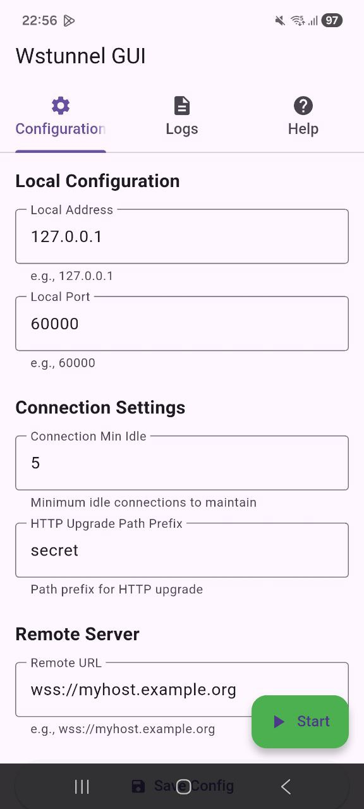
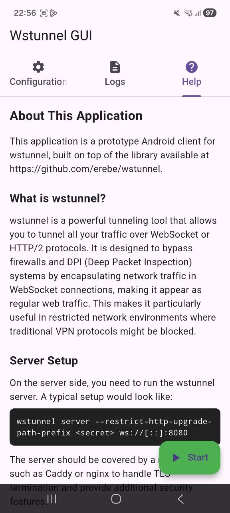

# wstunnel GUI for Android

A GUI application for [wstunnel](https://github.com/erebe/wstunnel) on Android, built with Flutter. This project provides a user-friendly interface to run wstunnel as a native Android application, eliminating the need to use console binaries within Termux.

## Screenshots




## Overview

This is a GUI client for wstunnel on Android, built on top of the excellent library available at [https://github.com/erebe/wstunnel](https://github.com/erebe/wstunnel).

Originally, wstunnel only existed as console binaries that needed to be run inside Termux, as described in [this tutorial](https://community.hetzner.com/tutorials/obfuscating-wireguard-using-wstunnel). This project addresses that limitation by building wstunnel as a native Android library (`libwstunnel.so`) that can be integrated with a Flutter-based GUI application.

## Important Notice

**⚠️ Disclaimer and Status**

This project is a **Minimum Viable Product (MVP)** and contains only basic functionality. It is **not recommended for production use**.

According to the BSD 3-Clause License, the author(s) of the original wstunnel library **do not endorse, support, or recommend this product** in any way.

**This software is provided "as is", without warranty of any kind, express or implied, including but not limited to the warranties of merchantability, fitness for a particular purpose and noninfringement. In no event shall the author(s) be liable for any claim, damages or other liability, whether in an action of contract, tort or otherwise, arising from, out of or in connection with the software or the use or other dealings in the software.**

## Technical Details

The original wstunnel library lacked FFI (Foreign Function Interface) support, which is required for integration with Flutter. To solve this, the source code from [commit d34a0033f13869a94c4d2992b0283fe8d36f723d](https://github.com/erebe/wstunnel/commits/d34a0033f13869a94c4d2992b0283fe8d36f723d) (version 10.5.1) was taken and FFI support was added. The library can now be built as `libwstunnel.so` for Android.

## How It Works

The GUI is very simple and essentially runs wstunnel as a client with the following equivalent command:

```bash
wstunnel client -L socks5://127.0.0.1:60000 --connection-min-idle 5 --http-upgrade-path-prefix <secret> wss://myhost.example.org
```

This opens a SOCKS5 proxy on port `60000/tcp` (configurable) that can be used by applications such as:
- Mozilla Firefox
- Telegram
- Any other application that supports SOCKS5 proxy configuration

**Note:** Redirecting all system traffic through this proxy is not recommended. Instead, configure individual applications to use the SOCKS5 proxy as needed.

## Server Setup

For server-side configuration, you can set up wstunnel behind Caddy in Docker as described in [this guide](https://github.com/BogdanNL/caddy-wstunnel). The manual shows how to run wstunnel with Caddy as a reverse proxy, which handles TLS termination and provides additional security features.

A typical server setup might look like:

```bash
wstunnel server --restrict-http-upgrade-path-prefix <secret> ws://[::]:8080
```

The server should be covered by a reverse proxy (such as Caddy or nginx) to handle TLS termination and provide additional security features.

## Configuration

The application allows you to configure:

- **Local Address**: The IP address where the SOCKS5 proxy will listen (typically `127.0.0.1`)
- **Local Port**: The port number for the SOCKS5 proxy (default: `60000`)
- **Connection Min Idle**: Minimum number of idle connections to maintain (default: `5`)
- **HTTP Upgrade Path Prefix**: The secret path prefix used for authentication
- **Remote URL**: The WebSocket URL of your wstunnel server (e.g., `wss://myhost.example.org`)

## Building

This project requires:
- Flutter SDK (3.5.0 or higher)
- Android NDK for building the native library
- Rust toolchain for building `libwstunnel.so`

**Versions used during development:**
- Flutter: 3.38.3 (Channel stable)
- Rust: 1.90.0

### Build Instructions

#### 1. Build the Native Library

First, set up the Android NDK environment variables and build the Rust library:

```bash
export ANDROID_NDK_ROOT=/home/user/Android/Sdk/ndk/28.2.13676358
export PATH="$ANDROID_NDK_ROOT/toolchains/llvm/prebuilt/linux-x86_64/bin:$PATH"
export TARGET_CC="$ANDROID_NDK_ROOT/toolchains/llvm/prebuilt/linux-x86_64/bin/aarch64-linux-android21-clang"
export TARGET_CXX="$ANDROID_NDK_ROOT/toolchains/llvm/prebuilt/linux-x86_64/bin/aarch64-linux-android21-clang++"
export TARGET_AR="$ANDROID_NDK_ROOT/toolchains/llvm/prebuilt/linux-x86_64/bin/llvm-ar"
export CC_aarch64_linux_android="$TARGET_CC"
export CXX_aarch64_linux_android="$TARGET_CXX"
export AR_aarch64_linux_android="$TARGET_AR"
export CARGO_TARGET_AARCH64_LINUX_ANDROID_LINKER="$TARGET_CC"
cd rust/wstunnel
cargo build --target aarch64-linux-android --release
cd ../..
```

**Note:** Adjust the `ANDROID_NDK_ROOT` path to match your Android NDK installation location.

#### 2. Copy the Library

Copy the built library to the Android project:

```bash
./copy_lib.sh
```

You should see output like:

```
File successfully copied:
  From: rust/target/aarch64-linux-android/release/libwstunnel.so
  To:   android/app/src/main/jniLibs/arm64-v8a/libwstunnel.so
```

#### 3. Build the Flutter APK

Build the Android application:

```bash
flutter build apk
```

After successful build, the APK will be available at:

```
build/app/outputs/flutter-apk/app-release.apk
```

The APK size is approximately 54.3MB.

See the project structure for Rust source code in the `rust/` directory.

## License

This project is based on wstunnel, which is licensed under the BSD-3-Clause license.

## Acknowledgments

- Built on top of [wstunnel](https://github.com/erebe/wstunnel) by [erebe](https://github.com/erebe)
- Server setup guide: [caddy-wstunnel](https://github.com/BogdanNL/caddy-wstunnel)

